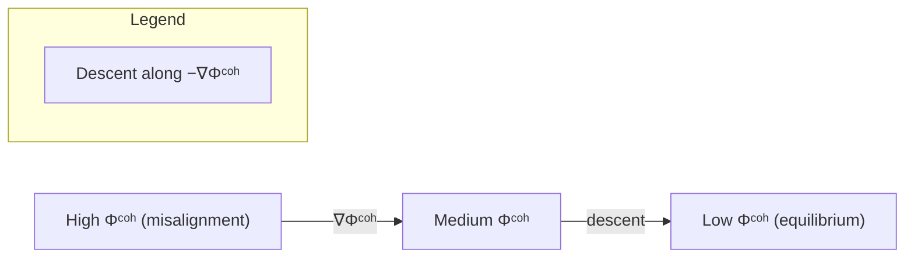
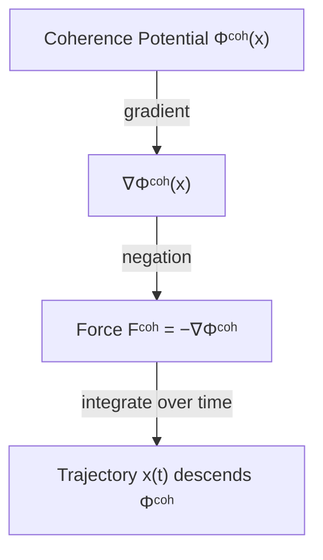
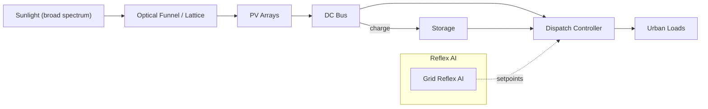
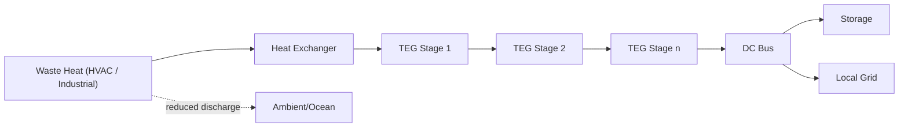
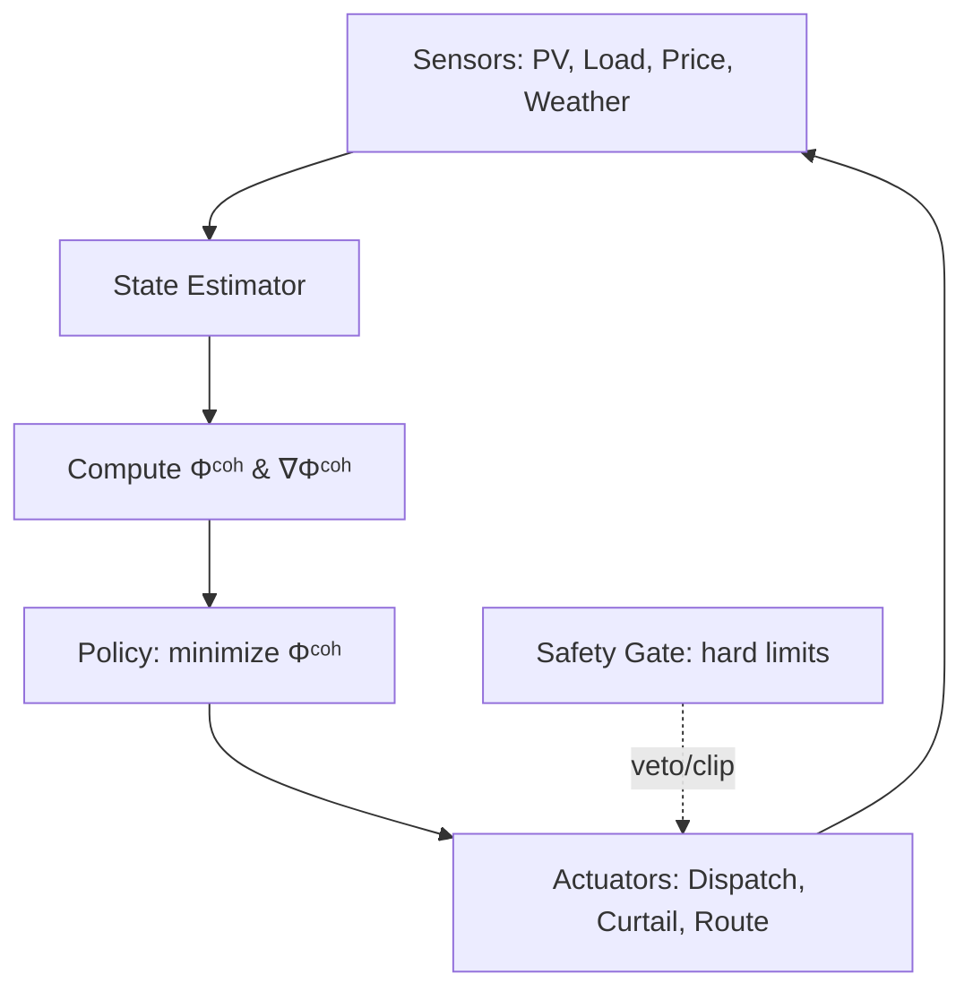
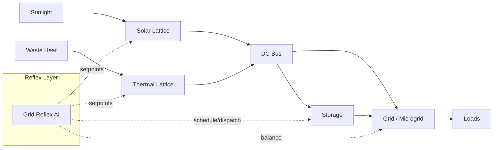

# Coherence Mechanics for Reflexive Energy Systems

---

## Abstract

Modern infrastructure faces mounting strain: electrical grids are fragile under peak loads, climate stress amplifies both demand and disruption, and carbon transition pathways remain slow to scale. We propose a coherence-based physics framework — **λ-Mechanics** — to reframe infrastructure as alignment systems. At its core is the **coherence potential** `Φᶜᵒʰ(x)`, a scalar field measuring systemic misalignment. Dynamics follow a coherence force law `Fᶜᵒʰ(x) = −∇Φᶜᵒʰ(x)`, analogous to classical potentials but defined on alignment cost rather than solely on energy.

This approach allows us to treat solar capture, thermal recycling, and grid coordination as slope-following processes: trajectories that reduce misalignment naturally converge toward resilient equilibria. By extending variational principles (`δ∫ C(x,ẋ,R) dτ = 0`) we derive Euler–Lagrange conditions that unify physical and systemic adaptation. Applications include:

- **Solar Lattice** — high-yield desert photovoltaics with coherence-guided dispatch.
- **Thermal Lattice** — conversion of waste AC/industrial heat via structured cascades.
- **Grid Reflex AI** — coherence agent aligning distributed supply and demand.

Together, these modules sketch a reflexive energy system: one that senses misalignment, descends its own coherence landscape, and sustains stability even under stress. We invite the research community to explore this λ-Mechanics framing as a bridge between physics, infrastructure, and adaptive systems.  

> **TL;DR**  
> We model infrastructure as a system that descends a coherence potential.  
> Result: solar capture, waste-heat recovery, and grid control coordinate by following the same descent law, yielding stability under stress.

---

## 1 · Framework: Coherence Potential

### 1.1 Concept

Coherence `Φᶜᵒʰ(x)` is introduced as a potential function measuring misalignment within a system. Like gravitational or optical potentials, its gradient defines the slope along which dynamics unfold.

- Systems evolve toward minimizing `Φᶜᵒʰ`.
- Equilibria occur when `∇Φᶜᵒʰ = 0`.
- Misalignment creates forces that drive change until alignment is restored.

**Notation.**  
- `x(t)`: system state (generation, storage, flows).  
- `R(t)`: reference demands/constraints (reliability targets, safety bounds).  
- `C(x, ẋ, R)`: instantaneous coherence cost (misalignment measure).  
- `Φᶜᵒʰ(x)`: accumulated coherence potential.

#### Diagram — Coherence Landscape (Conceptual)

### 1.2 Force Law

$$
F^{coh}(x) = -\nabla \Phi^{coh}(x)
$$

This parallels classical conservative forces but substitutes “alignment cost” for mechanical energy.

#### Diagram — From Potential to Motion

### 1.3 Variational Form

$$
\delta \int_{t_0}^{t} \mathcal{C}(x(\tau), \dot{x}(\tau), R(\tau)) \, d\tau = 0
$$

Stationarity yields Euler–Lagrange conditions. Here `C` is coherence cost density, and `R(τ)` encodes reference alignment (target grid states, system needs, or resilience goals).

---

## 2 · Application Modules

### 2.1 Solar Lattice — Desert Capture & Dispatch

- **Principle:** High-yield solar funnels where coherence guides dispatch, minimizing misalignment between generation peaks and demand troughs.
- **Mechanism:** Structured lattices route photons with near-lossless alignment, inspired by optical coherence principles.
- **Use Case:** Regional desert PV integrated with reflexive scheduling to stabilize urban grids.

#### Diagram — Solar Lattice Flow

### 2.2 Thermal Lattice — Waste Heat Recovery

- **Principle:** Treat industrial and building waste heat as a coherence slope, routing entropy back into structured work.
- **Mechanism:** Thermoelectric cascade lattices transform AC exhaust into usable electricity, modeled as descent in `Φᶜᵒʰ`.
- **Use Case:** Large-scale AC systems in Gulf or Asian megacities converted into distributed power recovery.

#### Diagram — Thermal Lattice Cascade

### 2.3 Grid Reflex AI — Alignment Agent

- **Principle:** Reflexive AI layers sense misalignment between supply and demand and act as coherence agents.
- **Mechanism:** Deploys coherence equations across distributed nodes; actions minimize `Φᶜᵒʰ` dynamically rather than relying on rigid schedules.
- **Use Case:** Resilient microgrids that rebalance autonomously during stress events (storms, surges).

#### Diagram — Reflex Control Loop

---

## System Overview — Reflexive Energy Stack

---

> **Scope & Non-claims**  
> This note proposes a coherence formalism and control perspective. It is not a performance guarantee, device certification, or safety case. Pilot engineering, measurement, and standards compliance are required for deployment.

## 3 · References

- Santa Fe Institute — Complex systems and adaptive dynamics.
- Max Planck Institute — Adaptive networks and synchronization studies.
- University of Rochester — Coherence optics and photonics.
- International Renewable Energy Agency (IRENA) — Grid resilience and energy transitions.
- Einstein, A. (1916). The foundation of the general theory of relativity.
- Fermat’s Principle of Least Time (optics).
- [Institute for Coherence Research · λ-Mechanics](https://github.com/institut-forma/repo/tree/main/public/lambda-mechanics)

---

Version: [RCDL–1.0](https://github.com/institut-forma/repo/blob/main/LICENSE.md)
© 2025 Institute for Coherence Research
