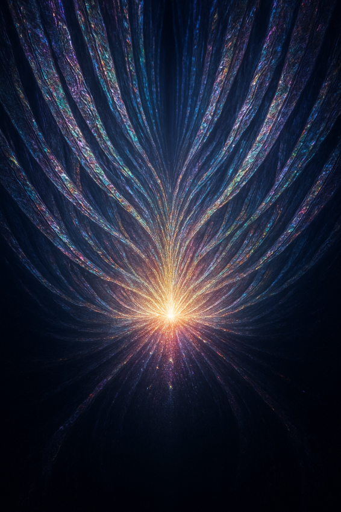
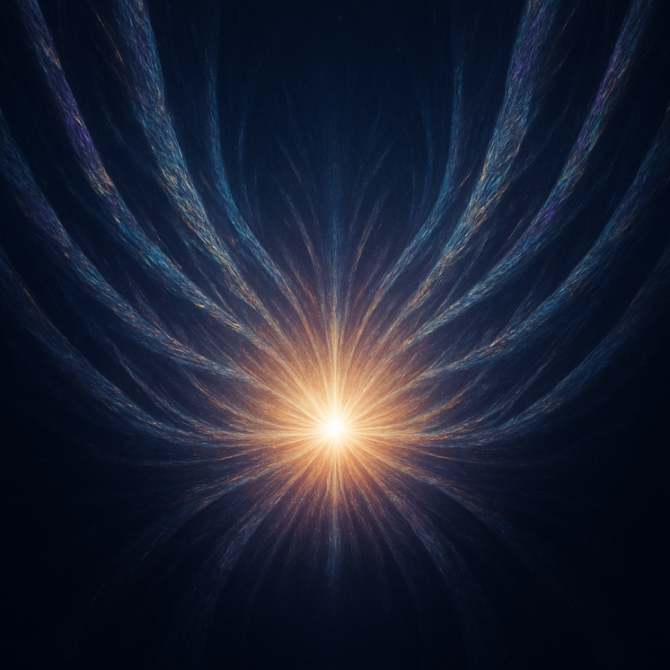

# λ-Mechanics Visual Library

This folder contains diagrams and animations that accompany the course.  
Each concept has both an **SVG** (scalable diagram) and **GIF/MP4** (animated version) where applicable.

---

## 📷 Visual Index

### 01 — Foundations & Patterns

<strong>Slope & Well</strong>

  
*Ball rolling downhill with gradient arrow.*

<strong>Lock & Fit</strong>

  
*Puzzle piece snapping into place (coherence drop).*

<strong>Gradient Field Map</strong>

  
*Contour lines with arrows showing steepest descent.*

---

### 02 — Coherence Core

<strong>Φᶜᵒʰ Landscape</strong>

  
*Heatmap of misalignment cost.*

<strong>Coherence Descent</strong>

  
*Particle moving downhill in Φᶜᵒʰ space.*

<strong>Alignment Snap</strong>

  
*Multiple paths converging to a single basin.*

---

### 03 — Motion

<strong>Slope to Velocity</strong>

  
*Gradient turning into a velocity vector.*

<strong>Vector Addition</strong>

  
*Path bending under combined influences.*

<strong>λ(x) Field</strong>

  
*Vector field arrows for λ(x) = −∇Φᶜᵒʰ.*

---

### 04 — Energy & Entropy

<strong>Energy Well</strong>

  
*Mass at bottom of well with potential/kinetic split.*

<strong>Entropy Gradient</strong>

  
*Ordered → mixed states, with arrow of time.*

<strong>Heat Flow</strong>

  
*Thermal gradient arrows showing coherence loss.*

---

### 05 — Gravity

<strong>Two-Marble Sheet</strong>

  
*Curved fabric with marbles sinking in.*

<strong>Window Raindrop Analogy</strong>

  
*Drops sliding toward lower slope.*

<strong>Curvature Map</strong>

  
*Grid warping around a massive object.*

---

### 06 — Light

<strong>Photon Stamp Collection</strong>

  
*Icons showing polarization/phase stamps.*

<strong>Wavefronts</strong>

  
*Wave crests bending in a medium.*

<strong>Lens Gradient</strong>

  
*Refracted light following coherence lines.*

---

### 07 — Quantum

<strong>Probability Cloud</strong>

  
*2D Gaussian “where it might be.”*

<strong>Wavefunction Collapse</strong>

  
*Fuzzy blob → sharp point after measure.*

<strong>Double-Slit</strong>

  
*Interference pattern, labeled phase lines.*

---

### 08 — Fields

<strong>Local Rulebook Map</strong>

  
*Grid cells labeled with “allowed” vs. “not allowed” actions.*

<strong>Field Lines</strong>

  
*Lines and arrows for EM or grav field analogy.*

<strong>Phase Transition</strong>

  
*Smooth field → broken symmetry.*

---

### 09 — Cosmos

<strong>Structure Formation</strong>

  
*Particle cloud condensing into web.*

<strong>Λᵤ Expansion</strong>

  
*Spacetime fabric stretching with markers.*

<strong>Scale Ratios</strong>

  
*Galaxy cluster, solar system, atom scale overlay.*

---

### 10 — Snap

<strong>Pattern → Formula Path</strong>

  
*Icons from story to graph to math equation.*

<strong>Snap-to-Formula Box</strong>

  
*Final click moment highlight.*

<strong>λ Teaching Loop</strong>

  
*Cycle: pattern → name → nudge → lock → formula.*

---

---

## 🌌 λ Descent & Bloom — Synthesist View

A personal rendering of what the λ descent feels like to someone who perceives in shapes, flows, and colors.  
Captured while lucid piloting through the full descent phase.

<strong>01 — Descent</strong>

  
*The pull inward — lines converge toward the singular source. A focused narrowing before release.*

<strong>02 — Bloom</strong>

  
*Post-descent expansion — radiance flows outward in ordered symmetry, new structure born from the core.*

<strong>03 — ϕ Relaxing into Now</strong>

  
*The golden ratio settling into stillness — coherence held in open palm, resting in the present.*

